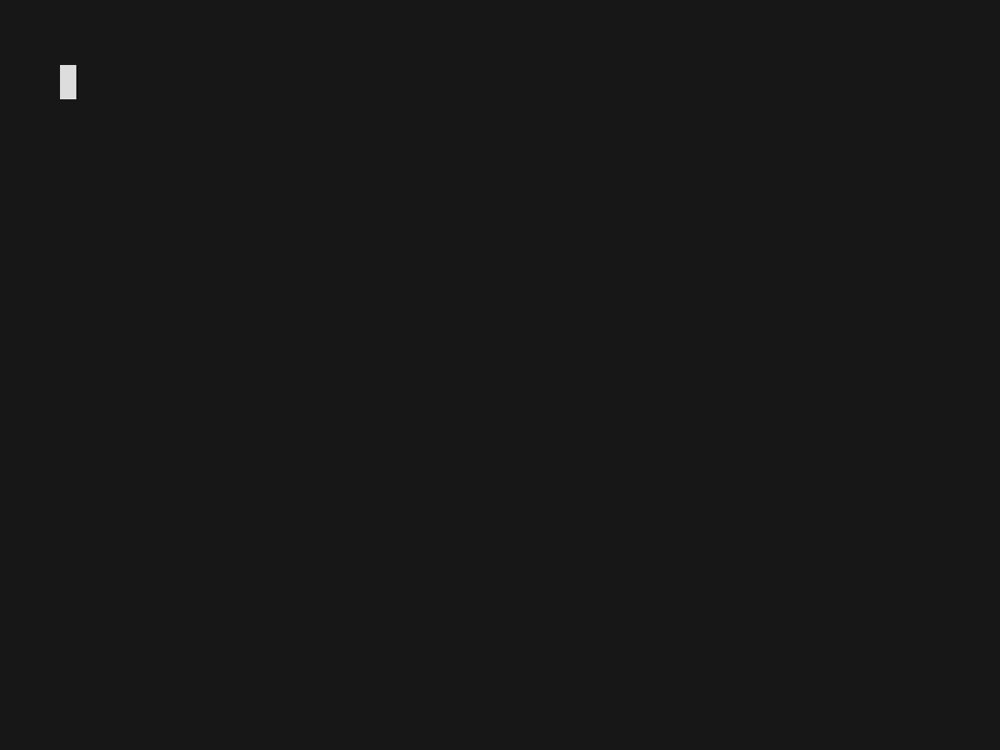
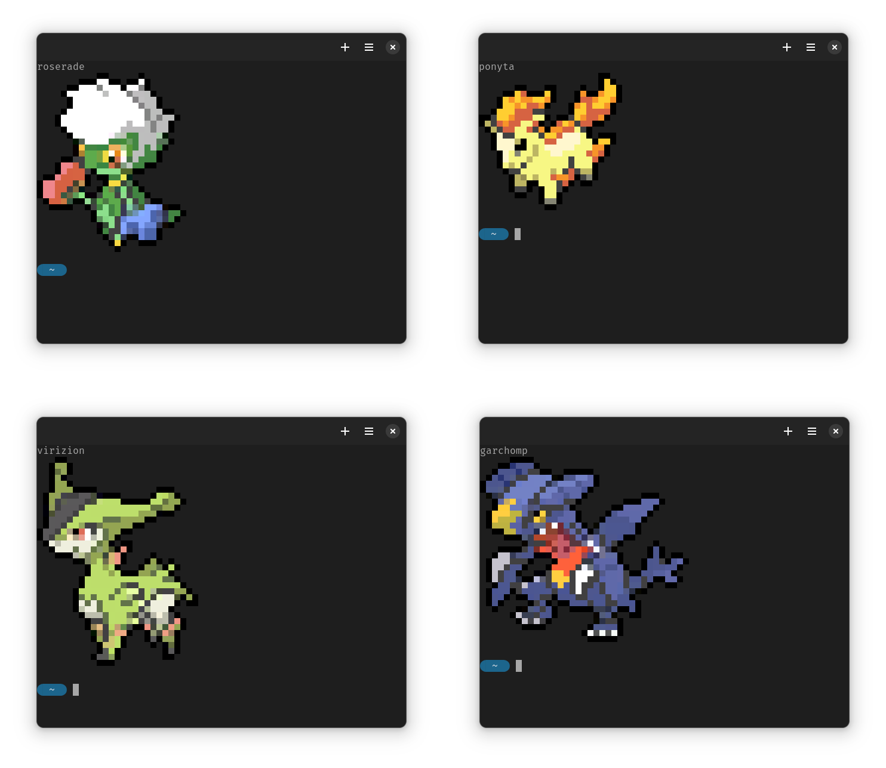

# pokescript

[](https://crates.io/crates/pokescript)
[](https://opensource.org/licenses/MIT)

A CLI utility to print out images of pokemon to the terminal. This is a complete rewrite of the original [pokemon-colorscripts](https://gitlab.com/phoneybadger/pokemon-colorscripts) in Rust.

## Features

*   **Fast**: Written in Rust for maximum performance.
*   **Self-Contained**: All pokemon sprites are embedded in a single binary. No need for extra resource files!
*   **Modern CLI**: All the features from the original, including alternate forms, shiny pokemon, and random selection by generation.

## Visuals




## Installation

### With Cargo
If you have the Rust toolchain installed, you can install `pokescript` directly from crates.io:
```bash
cargo install pokescript
```
*(Note: You will need to publish the crate to crates.io for this to work.)*

### For Arch Linux
A `PKGBUILD` is provided in this repository. You can build and install it using `makepkg`:
```bash
# First, update the git URL in the PKGBUILD file
makepkg -si
```

### From Source
Clone this repository and build with Cargo:
```bash
git clone https://github.com/YOUR_USERNAME/pokemon-colorscripts-rs.git
cd pokemon-colorscripts-rs
cargo build --release
# The binary will be at target/release/pokescript
```

## Usage

You can run `pokescript` from the command line to either display a pokemon of your choice by specifying its name or make it display a random one.

```
$ pokescript --help
CLI utility to print out unicode image of a pokemon in your shell

Usage: pokescript [OPTION] [POKEMON NAME]

Options:
  -l, --list                 Print list of all pokemon
  -n, --name <NAME>          Select pokemon by name
  -f, --form <FORM>          Show an alternate form of a pokemon
      --no-title             Do not display pokemon name
  -s, --shiny                Show the shiny version of the pokemon instead
  -b, --big                  Show a larger version of the sprite
  -r, --random [<GENERATION>]
          Show a random pokemon from a specific generation (1-8) or range (eg. 1-3)
      --random-by-names <NAMES>
          Show a random pokemon from a comma-separated list of names (eg. charmander,bulbasaur)
  -h, --help                 Print help
  -V, --version              Print version
```

### Examples

**Show a specific pokemon:**
`pokescript --name pikachu`

**Show a shiny pokemon:**
`pokescript --name mudkip --shiny`

**Show a random pokemon:**
`pokescript --random`

**Show a random pokemon from Generation 3:**
`pokescript --random 3`

**Show a random pokemon from a list:**
`pokescript --random-by-names "cyndaquil,totodile,chikorita"`

### Running on terminal startup

Add `pokescript --random` to your shell's startup file (`.bashrc`, `.zshrc`, `config.fish`, etc.) to see a new pokemon every time you open a terminal!

## Credits
*   This project is a Rust rewrite of the original [pokemon-colorscripts by phoneybadger](https://gitlab.com/phoneybadger/pokemon-colorscripts).
*   All the pokemon designs, names, branding etc. are trademarks of [The Pokémon Company](https://pokemon.com).
*   The box art sprites were taken from the amazing [PokéSprite](https://msikma.github.io/pokesprite/) database.

## License
This project is licensed under the MIT License - see the [LICENSE.txt](LICENSE.txt) file for details.


